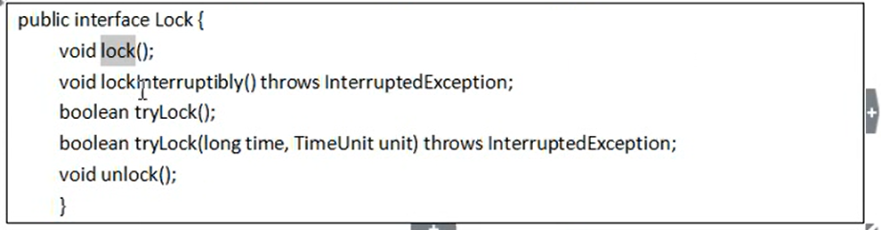

## 计算机基础知识

IP : 192.168.xx.xx  (每一段的大小都是8位bit,不超过255，192.168.xx.255为全网段广播地址)

NETMASK :  255.255.255.0 （用来判断自己属于哪个网段，将IP地址的二进制 & 子网掩码的二进制 = 网段地址）

GATEWAY :  路由器地址 (网络总出口)

DNS:  网关地址 (域名解析服务器)

主机名配置: /etc/hosts  、  主机IP配置: vi /etc/sysconfig/network-scripts/ifcfg-eth0

## linux常用命令

```latex
netstat -nltp  //查看服务进程
scp-copy-id **配置主机间的免密登录**

查看文件内容：
cat、more、less、tail
tail -10 install.log 查看文件尾部10行
tail -f install.log  实时查看，按照文件的唯一inode号跟踪，就算文件改名后，也是按照原来的inode号跟踪。
tail -F install.log  按照文件名跟踪

后台服务管理：
service network(服务) status/stop/start/restart
service --status--all 查看系统中的所有后台服务

系统启动级别管理：
chkconfig 查看所有服务的自启配置   chkconfig iptables off/on 关闭/开启服务自启
vi etc/inittab (单用户模式，多用户模式，图形化模式...)

vi /etc/profile 修改环境变量
```

linux文件权限的描述格式解读

```
drwxr-xr-x   [也可以用二进制表示  111 101 101  --> 755]
d:标识节点类型(d:文件夹 -:文件   l：链接)
r:可读   w:可写    x:可执行
第一组rwx:表示这个文件的拥有者对它的权限：可读可写可执行
第二组r-x:表示这个文件的所属组对它的权限：可读，不可写，可执行
第三组r-x:表示这个文件的其他用户（相对于上面两类用户）对它的权限：可读，不可写，可执行
```

修改文件权限

```
chmod g-rw haha.dat  将haha.dat对所属组的rw权限取消
chmod o-rw haha.dat  对其他用户-rw   chmod u+x 对所属用户的权限+x
```

文件夹权限

```
r：文件夹中的文件可以读  w:文件夹中的文件可以rm/修改  x:文件夹可以进入
```

用户管理

```
useradd angela
passwd angele
```

压缩/解压

```
打包：tar -zcvf my.tar.gz aaa/       解包：tar -zxcf my.tar.gz
     tar -cvf myfirstball.tar aaa/       tar -xvf myfirstball.tar   
压缩: gzip access.log  解压: gzip -d access.log.gz
```

bash的pstree特点以及export的作用域

```
....
```


## 高并发网络架构


## Zookeeper

Zookeeper是一个分布式协调程序：就是为用户的分布式应用程序提供协调服务

A、为别的分布式程序服务的

B、本身就是一个分布式程序【只有半数以上的节点存活，zk就能正常服务】

C、zk所提供的服务涵盖：主从协调，服务器节点动态上下线，统一配置管理，分布式共享锁，统一名称服务（注册服务后，可以直接通过服务名称调用服务，不再使用ip）

D、虽然说可以提供各种服务，但是zk在底层只提供两个功能：

​       管理（存储、读取）用户提交的状态数据，不是业务数据。为数据提供监听服务。

Zookeeper常见应用场景：

场景一：


场景二：


Zookeeper集群的角色： Leader 和 follwer (Observer)

集群角色分配原理[主从选举] ：

ZK通过主从关系解决数据一致性问题


节点类型： 

``` 
[zk1] create -e /app1 创建短暂节点 
[zk1] set /app1 "hhhhhh"
[zk1] get /app1
```


事件通知机制

```
[zk1] get /app1 watch   ##/app1目录下的数据发生变化,zk1上的客户端会收到通知
[zk1] ls /app1 watch  ##/app1的子节点发生变化时，zk1客户端收到通知
```

Zookeeper的javaAPI使用:

1、实现客户端一直监听的功能： 在通知事件的回调函数里再注册一个监听

2、zkClient监听和回调的底层源码流程：


分布式服务器上下线的动态感知：

场景：服务器会有动态上下线的情况

需求：客户端能实时洞察到服务器的上下线的变化


分布式共享锁：

场景：只有一个共享资源，多台机器同时工作时，怎么控制一个一个调用。


## IO

IO类型： 同步阻塞IO，异步阻塞IO

## 多线程

lock和synchronized的区别：

1、Lock不是java内置,Syn是内置的关键字。Lock是`concurrent`包下的类，通过这个类可以实现同步访问。

2、**[*]**当`syn`方法或者代码块执行完后，或者产生异常时，系统会自动让线程释放对锁的占用；而Lock则必须要用户去手动释放锁，就有可能出现死锁的情况。另一方面，syn不受用户控制，其他线程可能需要很长的时间去等待锁，无法执行其余业务，可以用`Lock`解决。

3、通过Lock可以知道有没有成功获得锁，而syn无法办到。

4、Lock可以提高多个线程读操作的效率。

在性能上，如果竞争资源不激烈，两者差不多，而当竞争激烈（大量线程同时竞争），此时lock性能远优于syn



`lockInterruptbly()`，当两个线程同时用此方法获取锁，线程A获取到锁，而线程B只有等待，那么对线程B调用`threadB.interrupt()`方法能够中断线程B的等待过程。线程A获取到锁，是不会被`interrupt()`方法中断的。

 因此利用`lockInterruptibly()`方法获取某个锁，在等待的情况下，是可以响应中断的，而用`syn`修饰，当一个线程在等待锁的状态下是无法被中断的，只有一直等待。

读写锁ReadWriteLock：

可以实现读写分离，读操作并发进行，即一个线程申请到读锁，那么其余线程申请读锁可以并发进行。

写操作锁定一个线程：

​     如果一个线程占用了读锁，则其他线程如果要申请写锁，则需等待。

​     如果一个线程占用了写锁，则其他线程申请写/读锁都需要等待。


线程池&并发消息队列&应用场景


1、线程池

`(1)Single Thread Pool`

`(2)Cached Thread Pool` 

`(3)Fixed Thread Pool`

调度：按时间调度

`(4)Scheduled Thread Pool`

`(5)Single Thread Scheduled Pool`

callable<?>返回结果,  runable不返回结果

**不用线程池的缺点**

a. 新建的线程开销代价大   b. 资源消耗量，没有一个池来限制线程的数量，会导致线程的数量直接取决于应用的并发量，这样有潜在线程数据巨大的可能。c. 影响操作系统的稳定性，卡死...

2、并发包消息队列BlockingQueue--主要用来控制线程同步的工具

`ArrayBlockingQueue` —大小固定

`LinkedBlockingQueue`—大小不定也可以指定

add(),poll()  抛异常 || take(),push() 阻塞

**volatile**保证了变量对线程间的可见性，但变量非线程安全的。

#### JMS(Java Message Service)

面向消息中间件（MOM）的API，用于在两个应用程序或分布式系统间发送消息，进行异步通信。作为一种规范，类似JDBC。

**消息服务应用程序支持结构支持两种模型**

1、点对点或队列模型

一个生产者向特定的队列发布消息，一个消费者从该队列读取消息，这里生产者知道消费者的队列。

2、发布者/订阅者模式

发布者和订阅者彼此不知道对方。

#### JVM

反射：获取class对象中的属性、方法、构造函数、类加载器、父类、获取资源....

动态代理：

应用场景：之前写好的service中的方法可能不满足现在客户的需求，需要重新修改service方法，但是service方法不只在我们这个模块调用还在其他模块调用（不能改动原方法），所以可以通过动态代理的方法，加强service的方法实现。


##### JVM内存模型


##### JVM垃圾回收器


##### JVM参数列表


#### NIO&Netty

传统IO、NIO、AIO的缓存流程，速度提升


#### Spring(IOC/AOP)

IOC:自动注入依赖


#### 轻量级RPC框架开发

 RPC框架开发流程：


自定义RCP框架：


## Hadoop

利用服务器集群，根据用户的自定义业务逻辑，对海量数据进行分布式处理。

##### 1、hadoop应用

基于用户日志分析的推荐系统架构图


##### 2、JavaApi操作HDFS文件系统

[1] 客户端Api去操作hdfs时，是有一个用户身份的，默认情况下，hdfs客户端api会从jvm获取一个参数作为自己的用户身份：-DHADOOP_USER_NAME=hadoop，也可以在构造客户端fs对象时通过参数传递进去。

[2] HDFS的内部机制对客户端保持透明，客户端请求访问HDFS都是通过向namenode的申请来进行的。


**客户端向HDFS写数据流程：**

每次切128M重复以下流程，即第二个128M数据块可能分配的namenode不一样。


**客户端读HDFS数据流程：**


**namenode**管理元数据机制：

​      datanode配置多个目录可以并发读写，namenode配置多个目录保存同样的edits,保证数据不丢失。

​      namenode的硬盘损坏，因为secondarynamenode的目录与namenode一样，所以直接将其元数据目录拷贝到namenode即可恢复。

​      namenode的工作目录应该配在多块磁盘，避免容灾。

​      


  流式hdfsApi操作

 ##### 3、hadoop中的RPC框架工具类（可以直接实现rpc服务）


## MapReduce

分布式运算程序的编程框架。

##### 1、应用场景:  统计各个文件中每一个单词出现的总次数

 

##### 2、应用场景：wordCount细节分析


##### 2、mapTask的任务分配机制&mapTask和reduceTask之间的衔接&mapTask运行失败的处理

都通过mr application master来管理。

maptask并行度：任务切片，是一个逻辑划分，一个切片对应一个maptask实例，可能一个maptask处理一个blk文件，或者一个blk的一部分，但不会超过一个blk文件的大小。

##### 3、客户端提交job流程


##### 4、客户端给mapTask任务分配的源码流程

* 遍历(规划切片)待处理数据文件

* 计算文件大小
* 计算切片大小`computeSplitSize(Math.max(minSize,Math.max(maxSize,blocksize))) ###blocksize=128MB`  对应上述的maptask并行度。minSize和maxSize提前自定义。
* 开始切片，并形成n个切片
* 将切片信息序列化到切片规划文件中，定位mr application master启动n个maptask进程，读取处理hdfs中的文件。

##### 5、partition数据切分和reduceTask的任务分配机制

reduceTask数量提前自定义，partition切分maptask处理完的数据给reducetask处理。

默认任务分配方式：`  reduceTaskNode = (key.hashCode()&Integer,MAX_VALUE)%numReduceTasks`

如上是分配给不同号码的reduceTask公式，分布在不同maptask的相同对象的hashCode都是一样的，那么他们的hashCode经过上述计算都能分配给同一个reduceTask

自定义任务分配方式也可以建立一个reduceTaskNode和key之间的映射表，自定义partition按需分配。

